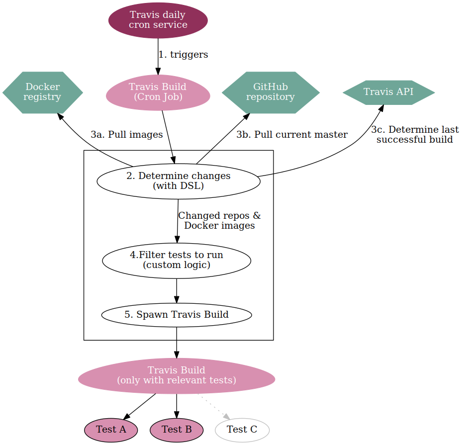

# Travis CronTools 

This gem provides a library to (conditionally) spawn Travis Builds, each potentially
consisting of multiple jobs.

## Why?
Having a good Continous Integration setup is crucial for developing software.
However, running a CI test may be expensive and slow. An example is if your CI sequentially triggers
the creation of a large number of virtual machines.

Note that the number of executed tests depends on both the frequence of build triggers and the number of tests.
This tool enables the creation of a CI pipeline that can reduce both by selectively 
running tests, and increase speed by introducing parallel execution of tests.

## Reducing tests & Increasing speed
We can reduce the number of tests to run over time, by:

- Filtering out test-combinations that have not changed
- Not building every change, but run tests based on time intervals

### Reducing number of tests to run
If a system is designed correctly, it is clear which parts depend on others.
We can get away with running less tests if we can filter out components that have not changed since
the last sucessfull test, and only run the tests that actually have changed.

In the area of microservices, this is easier to do than in a monolith; you just check if the
version of a depdant microservice has changed, to trigger our own build.

The filter logic is highly coupled with the application and therefore we have not made any attempt
provide a generic solution. However, we provide a DSL with helper functions that can check for
changes in Docker Image Registries in Git repositories.

### Reducing the number of build triggers
The first can be solved by just building the test suite afer a certain time interval, 
such as every hour, day, or week.

Travis offers Cron jobs, that can be run daily, weekly or monthly.
Therefore, we can run the expensive tests just once a day.

### Increasing speed
A Travis build can have multiple Jobs, which typically are created via the `matrix` feature
in `.travis.yml` files. 
In the DSL we provide a way to spawn new Travis Builds, each of which can have multiple Jobs.

## Walktrough
1. Travis triggers a Cron build.
2. The `.travis-cron.rb` file is run; this is a plain ruby file, which used `spawn_travis_build`
   as a library.
3. This script uses the `spawn_travis_build` library to fetch information from dependent artifacts
   like Docker and Git, and computes for each of them when the last change was made.
   Based on the last successfull cron build, the library computes the dependencies that have been
   changed.
4. Based on the changed dependencies, you compute which test commands must be run. You have
   to generate the contents of a new `travis.yml`.
5. The library handles the nitty gritty details of actually creating a new build that only spawns
   the relevant jobs.

In the example below, there are three potential tests. After computing the changed dependencies,
it is determined that only two of the three tests have to run.

## How to use these tools
See the [example](example/example.rb) for some possibilities.

I suggest to integrate this in your project by doing the following steps:
- Enable the Travis Cron feature, set it to daily.
- Write logic in Ruby, using the tools provided by this gem.
- Add `if [[ $TRAVIS_JOB == "cron" ]]; then ruby .travis-cron.rb; fi` to `.travis.yml`
  where `.travis-cron.rb` is the file that contains your logic.

## Installation
Install the the gem by running `$ gem install spawn_travis_build`

## Development
After checking out the repo, run `bundle install` to install gem dependencies. 
Then, run `rake test` to run the tests.
You can also run `bin/console` for an interactive prompt that will allow you to experiment.

To install this gem onto your local machine, run `bundle exec rake install`.
To release a new version, update the version number in `version.rb`, and then run 
`bundle exec rake release`, which will create a git tag for the version, push git commits and tags,
  and push the `.gem` file to [rubygems.org](https://rubygems.org).

## Contributing
Bug reports and pull requests are welcome on GitHub at https://github.com/microservices-demo/spawn_travis_build.
This project is intended to be a safe, welcoming space for collaboration, and contributors are
expected to adhere to the [Contributor Covenant](http://contributor-covenant.org) code of conduct.

## License
The gem is available as open source under the terms of the [MIT License](http://opensource.org/licenses/MIT).
